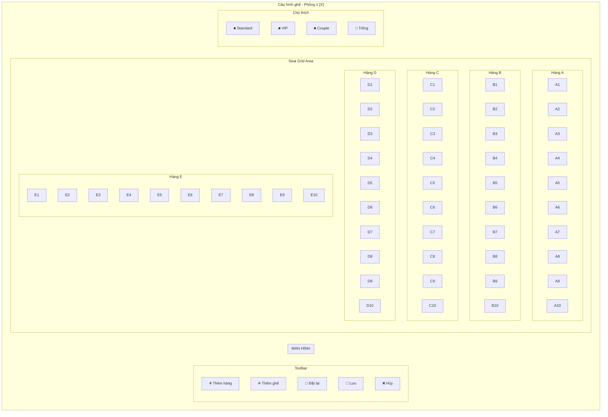
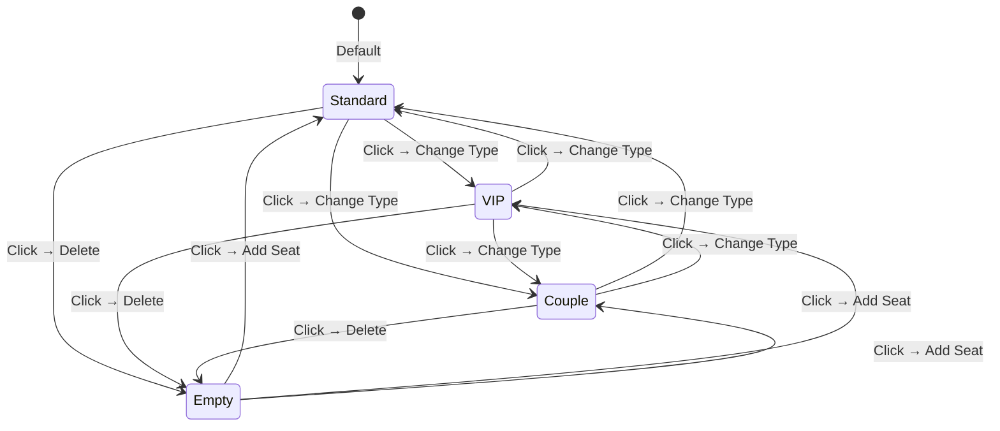
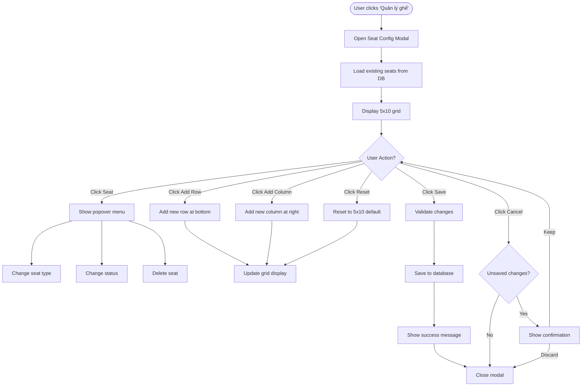
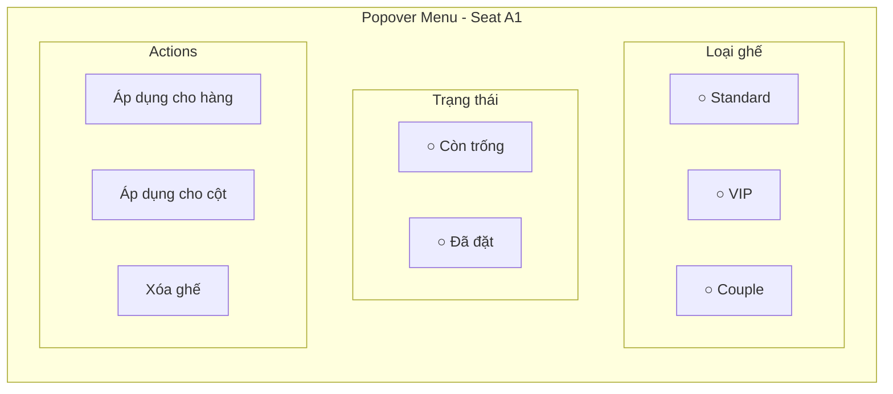
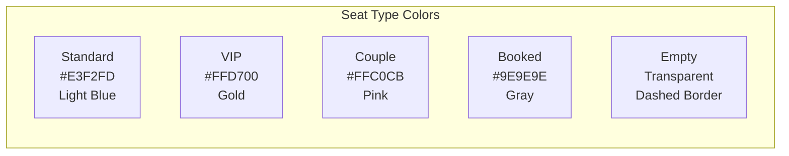
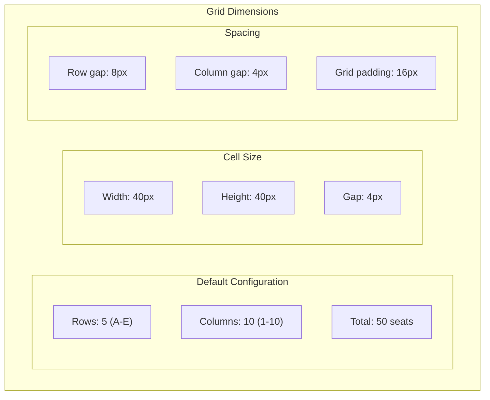
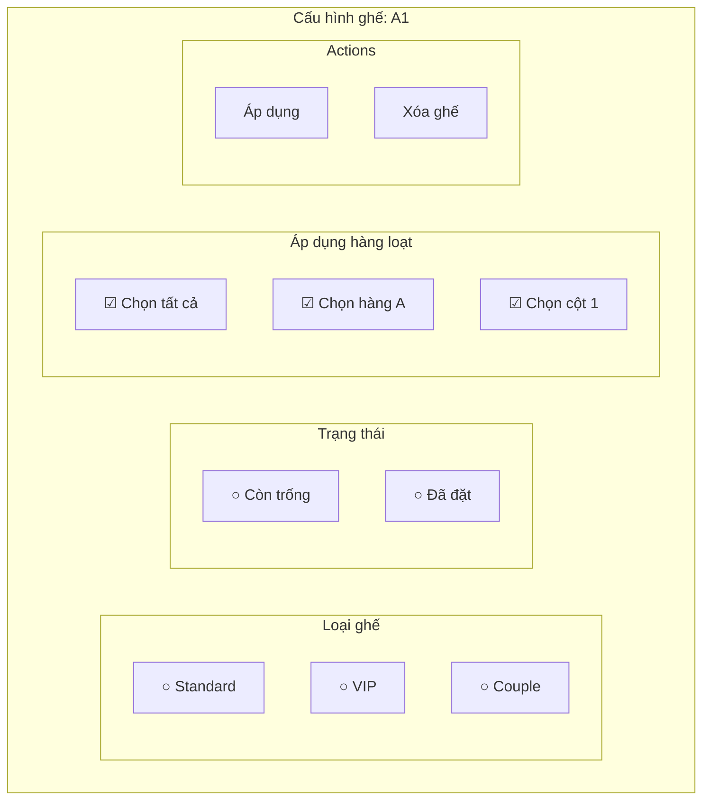
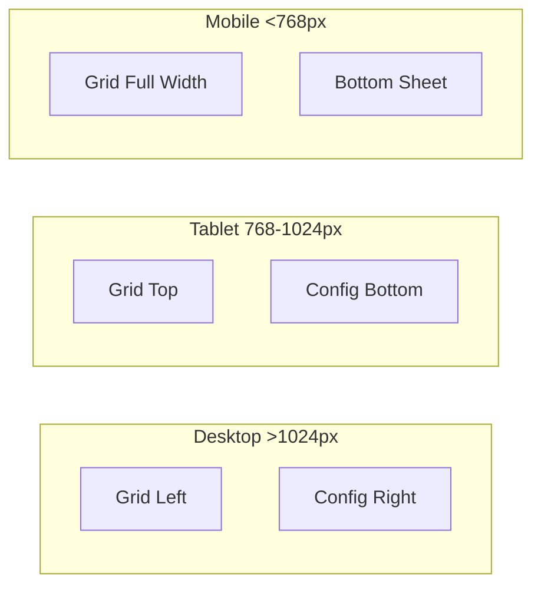
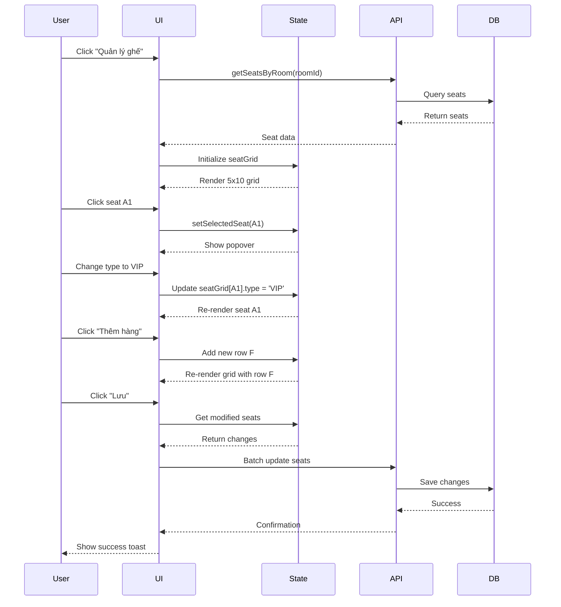

# Seat Configuration Modal - Visual Wireframe

## Main Modal Layout

## Seat Cell States

## User Interaction Flow

## Seat Popover Menu

## Color Scheme

## Grid Layout Dimensions

## Configuration Panel (Right Side)

## Responsive Layout

## Data Flow

## Key Features Summary

1. **Visual Grid Layout**: 5 rows × 10 columns by default
2. **Click-to-Configure**: Click any seat to change type/status
3. **Dynamic Rows/Columns**: Add rows and columns on demand
4. **Color Coding**: Different colors for seat types
5. **Bulk Operations**: Apply changes to multiple seats
6. **Real-time Preview**: See changes immediately
7. **Reset Option**: Return to default configuration
8. **Validation**: Prevent invalid configurations
9. **Responsive Design**: Works on all screen sizes
10. **Accessibility**: Keyboard navigation and screen reader support
